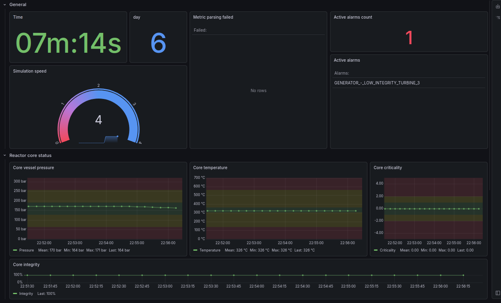

# Script for Nucleares and script_exporter

This is a script for the game [Nucleares](https://store.steampowered.com/app/1428420/) which transformes the data from the Nucleares webserver into prometheus metrics. This script is intended to be used with the [prometheus script_exporter by ricoberger](https://github.com/ricoberger/script_exporter).

This script is not affiliated with the game, script_exporter, prometheus, grafana or its developers. It is an independent project.

## Grafana dashboard

Here is my WIP example dashboard



Code: [grafana_example_dashboard.json](grafana_example_dashboard.json)

## script_exporter config

Here is my example config for script_exporter

```yaml
scripts:
  -
    name: Nucleares
    command:
      - ./nucleares_batch.js
    output:
      ignore_on_error: true
      format: prometheus
    cache:
      duration: 0
```

Here is my example config for prometheus:

```yaml
- job_name: Nucleares
  static_configs:
    - targets: ['script_exporter_address_here:9469']
  metrics_path: /probe
  params:
    script:
      - Nucleares
  scrape_interval: 5s
  scrape_timeout: 4s

```

# Not very detailed setup instructions:

Requirements: Know how grafana, prometheus and script_exporter work. This isn't a tutorial for grafana/prometheus.

 1. Set up a grafana, prometheus and script_exporter (I'd recommend you spin up a script_exporter on the same machine the game is running on)
 2. Download node.js on the machine running script_exporter
 3. Download the [nucleares_batch.js](nucleares_batch.js), place it wherever you see fit and make it executable for the user running the script_exporter
 4. Configure script_exporter (use the example config above as an inspiration) (Windows users: Idfk if you need to modify the config so script_exporter can actually execute the .js script, maybe try adding node.exe before? Or create a .cmd script with then uses node to start the .js? Or just use Linux, shebang go brrrrrrr /s )
 5. Start the script_exporter
 6. Start the game and use the tablet to start the webserver (Status, Start webserver) (Leave the default options if the script_exporter is running on the same machine)
 7. Configure a prometheus job to actually scrape the script_exporter (use the example config above as an inspiration)
 8. Have fun and build dashboards (use the example above as inspiration) :3
 9. Trans rights! 🏳️‍⚧️ 🏳️‍🌈
